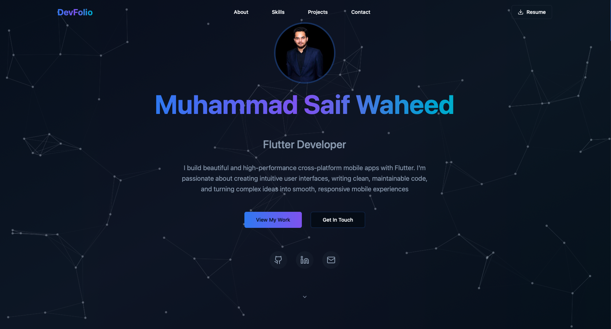
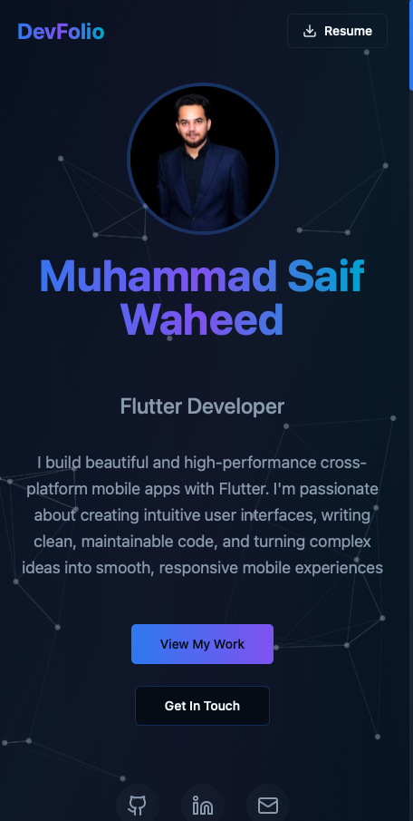
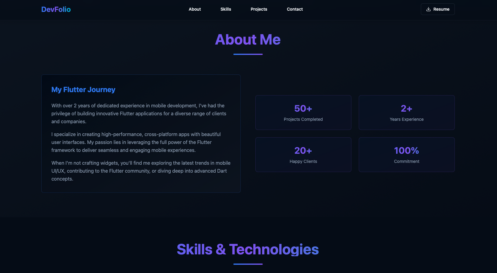

# DevFolio — Developer Portfolio

A sleek, fully responsive portfolio template built with modern technologies like **React**, **TypeScript**, **Tailwind CSS**, and **Vite**. DevFolio is designed to showcase your projects, skills, experience, and contact information in a clean and professional layout.

## 🌐 Live Demo

👉 [View Portfolio](https://saifu.me)

---

## ✨ Features

- ⚡️ Blazing fast performance (Vite-powered)
- 🖥️ Responsive design (mobile, tablet & desktop)
- 🌙 Dark and light mode support
- 💼 Featured projects section with GitHub/live demo links
- 📊 Skills, experience, and about sections
- ✉️ Contact form (EmailJS or external form integration)
- 🔗 Social links and resume download

---

## 📸 Screenshots

| Desktop | Mobile |
|--------|--------|
|  |  |


|  


---

## 🚀 Tech Stack

- **Frontend:** React, TypeScript, Tailwind CSS
- **Build Tool:** Vite
- **Icons:** Lucide, Heroicons
- **Animations:** Framer Motion
- **Forms:** EmailJS (optional)

---

## 🛠️ Installation & Setup

```bash
# 1. Clone the repository
git clone https://github.com/SafuRaja7/saifuraja-dev.git

# 2. Navigate into the directory
cd devfolio

# 3. Install dependencies
npm install

# 4. Start the dev server
npm run dev
